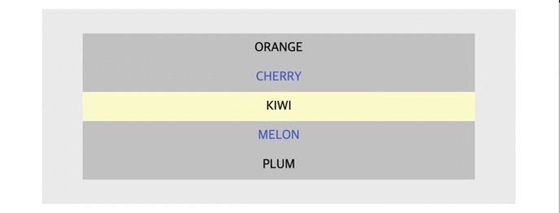
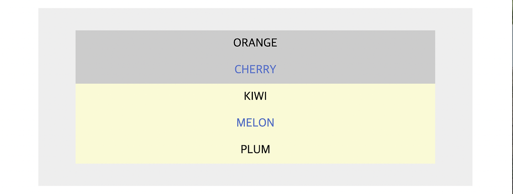

# CSS 복합 선택자

```html
<!DOCTYPE html>
<html lang="en">
  <head>
    <meta charset="UTF-8">
    <meta http-equiv="X-UA-Compatible" content="IE=edge">
    <meta name="viewport" content="width=device-width, initial-scale=1.0">
    <title>Fruit Name</title>
    <!--브라우저 스타일 초기화-->
    <link href="https://cdn.jsdelivr.net/npm/reset-css@5.0.2/reset.min.css" rel="stylesheet">
  </head>
  <body>
    <div class="box">
      <ul class="fruits">
        <li class="orange">ORANGE</li>
        <li class="cherry">CHERRY</li>
        <li class="kiwi">KIWI</li>
        <li class="melon">MELON</li>
        <li class="plum">PLUM</li>
      </ul>
    </div>
  </body>
</html>
```

이러한 태그 구조가 있다고 가정해 볼 때,

```css
.fruits * {background:#ccc; text-align:center; }
```

<span>*</span> 은 모든 태그를 선택하는 선택자로  
이 상황에서는 .fruits 안에 있는 모든 태그(= 모든 li 태그)를 선택하게 되어 다음과 같은 결과가 나온다.


**-배경색상 변화와 텍스트 가운데 정렬이 됨**

***

```css
.fruits *:nth-child(2n) {color:rgb(79, 111, 208);}
```

2n에서 n은 0부터 시작하는 숫자이다.  
2n은 _2x0, 2x1, 2x2, 2x3 ..._ 으로 해당 코드는  
.fruits 안에 있는 자식 태그 중에 0번째, 2번째, 4번째 ... 태그를 선택하게 되어 아래의 결과가 나온다.  
+  
:nth-child(2n+1) -> _2x0+1, 2x1+1, 2x2+1, 2x3+1 ..._ 으로 해석


**- 2n번째 태그만 색상이 변경됨**


***

```css
.fruits *:not(span) {padding: 10px 0;}
```

.fruits 안에 있는 자식 태그 중에 span 태그가 아닌 것을 선택한다.


**- span이 아닌 모든 태그에 내부 여백이 생김**

***

```css
.cherry + li {background: lightgoldenrodyellow;}
```
.cherry의 바로 다음 형제 li 태그를 선택한다.



**.cherry 다음 형제인 .kiwi의 배경색상이 변경됨**

***

```css
.cherry ~ li {background: lightgoldenrodyellow;}
```

.cherry의 다음 태그들 중 모든 li 태그를 선택한다.



**.cherry 다음의 모든 li 태그의 배경색상이 변경됨**
